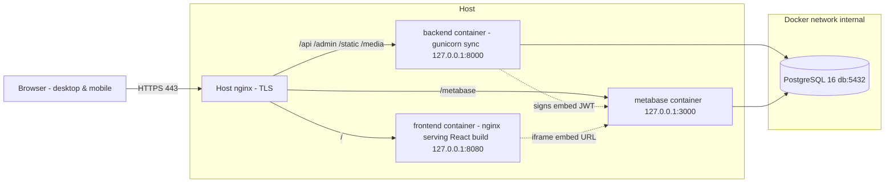

# 01 — Architecture

## 1.1 Runtime topology

A single **host nginx** is the only process exposed to the network. Everything else runs in Docker
and binds **only to `127.0.0.1`**, so the host nginx is the sole entry point (it terminates TLS).



Key points:

- The **frontend** is a static React build served by a tiny nginx inside its own container. The
  **host** nginx reverse‑proxies to it. (Serving static React from the host nginx directly is also
  acceptable; the container form keeps the deployment self‑contained — pick one and be consistent.)
- The **backend** serves `/api/*`, the Django admin (`/admin/*`) and its own static/media via
  **WhiteNoise**, so nginx does not need to know about Django’s static files.
- **Metabase** runs the OSS image, stores its own metadata in a dedicated database, and reads the
  application’s **reporting views** through a read‑only role. Dashboards are **embedded** in the
  React app using **signed (static) embedding**: the backend signs a short‑lived JWT with the
  Metabase embedding secret; the frontend loads the resulting URL in an `<iframe>`.
- **One PostgreSQL instance, two databases:** `mse` (application) and `metabaseappdb` (Metabase
  internal). See `07_deployment.md`.

## 1.2 Why synchronous

The reference project covers ~17 communes across 4 regions with on the order of hundreds of
indicator measurements, activities, financial lines and contracts per reporting period. This is
**low volume**. Therefore:

- DRF views are plain synchronous `ViewSet`/`APIView` classes.
- **gunicorn** runs **sync workers** (`--worker-class sync`, a handful of workers + threads).
- **Exports** (Excel via `openpyxl`, PDF via WeasyPrint) are generated **inside the request**. A
  large export streams its response; it does not spawn a background job.
- **No Celery, no Redis broker, no Channels/websockets.** Any “scheduled” need (e.g. submission
  reminder emails) is a Django **management command** run by a host **cron** entry, not a worker.
- The frontend uses ordinary `axios` request/response (awaited promises with a spinner). No polling
  loops, no sockets.

## 1.3 Backend dependencies (`backend/requirements.txt`)

Pin to these majors/minors; let patch float.

```
Django==5.2.*
djangorestframework==3.16.*
psycopg[binary]==3.2.*           # Django 5.2 uses psycopg 3
django-cors-headers==4.*         # CORS for the SPA
djangorestframework-simplejwt==5.*  # JWT auth for the SPA
django-filter==25.*              # declarative filtering on list endpoints
drf-spectacular==0.28.*          # OpenAPI 3 schema + Swagger/Redoc UI
django-simple-history==3.*       # row-level change history (audit)
openpyxl==3.1.*                  # Excel export
WeasyPrint==65.*                 # HTML->PDF export (needs system libs, see Dockerfile)
PyJWT==2.*                       # sign Metabase embedding tokens
gunicorn==23.*                   # sync WSGI server
whitenoise==6.*                  # serve Django static without nginx
python-dotenv==1.*               # load .env in non-container dev (optional)
Pillow==11.*                     # image fields (project logo, attachments)
```

> WeasyPrint needs OS packages (`libpango`, `libcairo`, `libgdk-pixbuf`, fonts). The backend
> Dockerfile in `07_deployment.md` installs them. If the team prefers, ReportLab is an
> alternative with no system deps — but WeasyPrint produces nicer tabular reports from HTML.

## 1.4 Frontend dependencies (`frontend/package.json`)

```jsonc
{
  "dependencies": {
    "react": "18.3.1",
    "react-dom": "18.3.1",
    "react-router-dom": "^6.26.0",
    "primereact": "^10.9.0",
    "primeicons": "^7.0.0",
    "primeflex": "^3.3.1",
    "bootstrap": "^5.3.3",
    "axios": "^1.7.0",
    "@tanstack/react-query": "^5.51.0",
    "i18next": "^23.12.0",
    "react-i18next": "^15.0.0",
    "i18next-browser-languagedetector": "^8.0.0",
    "date-fns": "^3.6.0",
    "zod": "^3.23.0",
    "react-hook-form": "^7.52.0",
    "@hookform/resolvers": "^3.9.0"
  },
  "devDependencies": {
    "vite": "^6.0.0",
    "@vitejs/plugin-react": "^4.3.0",
    "vitest": "^2.0.0",
    "@testing-library/react": "^16.0.0",
    "eslint": "^9.0.0",
    "prettier": "^3.3.0"
  }
}
```

**Styling order matters.** Import in this order in `src/main.jsx` so the cascade is predictable:

1. `primereact/resources/themes/lara-light-blue/theme.css` (PrimeReact theme)
2. `primereact/resources/primereact.min.css`
3. `primeicons/primeicons.css`
4. `primeflex/primeflex.css`
5. `bootstrap/dist/css/bootstrap.min.css`
6. `src/styles/app.scss` (project overrides — last, wins)

> **PrimeReact + Bootstrap coexistence:** both ship layout/utility CSS. Use **PrimeReact components**
> for all interactive widgets (DataTable, Calendar, Dropdown, Dialog, etc.) and use **Bootstrap’s
> grid + utilities** (and PrimeFlex) for page layout/spacing. Avoid Bootstrap’s JS components
> (modals, dropdowns) — use the PrimeReact equivalents to prevent double‑theming. Scope any
> conflicts in `app.scss`. Do **not** import Bootstrap’s JS bundle.

## 1.5 Repository layout (monorepo)

```
me-platform/
├── docker-compose.yml
├── .env.example
├── deploy/
│   ├── nginx.host.conf            # goes on the HOST nginx (sites-available)
│   ├── postgres/init.sql          # creates mse + metabaseappdb + roles
│   └── metabase/                  # optional provisioning notes/scripts
├── backend/
│   ├── Dockerfile
│   ├── requirements.txt
│   ├── manage.py
│   ├── config/                    # Django project (settings, urls, wsgi)
│   │   ├── settings/
│   │   │   ├── base.py
│   │   │   ├── dev.py
│   │   │   └── prod.py
│   │   ├── urls.py
│   │   └── wsgi.py
│   └── apps/
│       ├── core/                  # Project, reference base classes, audit, workflow mixin
│       ├── accounts/              # User, Role, scoping, auth, Metabase token endpoint
│       ├── geo/                   # GeoLevel, GeoUnit (configurable hierarchy)
│       ├── program/               # ProgramNode (components/sub-components/actions)
│       ├── indicators/            # Indicator, targets, dimensions, Measurement
│       ├── activities/            # Training, FieldVisit, Meeting, SubProject, Stakeholder, Note
│       ├── finance/               # ExpenseCategory, BudgetLine, FinancialTransaction
│       ├── procurement/           # methods, PPM items, processes, stages
│       ├── grievances/            # MGP
│       └── reporting/             # report templates, generation, exports, SQL view migrations
├── frontend/
│   ├── Dockerfile                 # multi-stage: build then nginx:alpine
│   ├── nginx.conf                 # container nginx (serves SPA, fallback to index.html)
│   ├── package.json
│   ├── vite.config.js
│   ├── index.html
│   └── src/
│       ├── main.jsx
│       ├── App.jsx
│       ├── routes/
│       ├── layout/                # AppShell, Topbar, Sidebar, ProjectSwitcher
│       ├── features/              # one folder per domain area (mirrors backend apps)
│       ├── components/            # reusable UI (DataTablePage, FormDialog, WorkflowBadge, ...)
│       ├── services/              # axios client, api modules, react-query hooks
│       ├── auth/                  # auth context, guards
│       ├── i18n/                  # fr.json, en.json, config
│       └── styles/
└── docs/                          # this spec can live here
```

The **frontend `features/` folders mirror the backend `apps/`** so a coding agent can work one
vertical slice at a time (e.g. `indicators` backend app ↔ `indicators` frontend feature).

## 1.6 Cross‑cutting conventions

- **API base path:** `/api/v1/`. Versioned from day one.
- **Auth:** JWT (SimpleJWT). `POST /api/v1/auth/token/` (obtain), `…/token/refresh/`. Access token
  short‑lived (~30 min), refresh longer (~7 days). Frontend stores tokens in memory + refresh in an
  `httpOnly`‑style flow is ideal, but given the SPA constraints, store refresh in `localStorage`
  and access in memory; document the tradeoff. (Upgrade path: cookie‑based later.)
- **Project context:** the current project id is sent on every request as a header
  `X-Project-Id` **and** is enforced server‑side from the user’s membership; the header only selects
  among projects the user may access.
- **Pagination:** DRF `PageNumberPagination`, `page_size=25`, `?page=`, `?page_size=`.
- **Filtering/search/sort:** `django-filter` + DRF `SearchFilter` + `OrderingFilter` on every list.
- **Errors:** DRF default error shape; validation errors return field‑keyed messages the frontend
  maps onto form fields.
- **Timestamps & users:** every domain row has `created_at`, `updated_at`, `created_by`,
  `updated_by` (via an abstract `TimeStampedModel` / `AuthoredModel` in `core`).
- **Soft delete:** reference data (geo, program, indicators, categories) uses `is_active` rather
  than hard delete, to preserve historical measurements. Transactional records hard‑delete only in
  DRAFT state.
- **OpenAPI:** `drf-spectacular` serves the schema at `/api/v1/schema/` and Swagger UI at
  `/api/v1/docs/`. Keep it accurate — the frontend agent reads it.
- **IDs:** integer PKs are fine; expose a stable `code` (slug/business code) on reference entities
  for human‑readable references and seed idempotency.
- **Locale/format:** currency and number formatting derive from the **Project** (`currency_code`,
  `currency_symbol`, e.g. `MRU` / `UM`); never hard‑code Ouguiya. Dates ISO in the API; localised in
  the UI (`date-fns` with the `fr` locale by default).

## 1.7 Non‑functional requirements

- **Responsive:** must be fully usable on a phone (field agents capture data on mobile). Bootstrap
  grid + PrimeReact responsive table modes (stacked on small screens). See `05_frontend_spec.md`.
- **Accessibility:** PrimeReact components are ARIA‑friendly; keep labels on every field.
- **Auditability:** every state transition and every edit to a consolidated record is traceable
  (who/when/what) — required by the manual.
- **Offline tolerance (light):** not required for v1 (sync, online). Note as a future option.
- **Browsers:** evergreen Chrome/Edge/Firefox/Safari; mobile Chrome/Safari.
