# 02 — Domain model & data model

This is the backbone of the platform. It is **generic by construction**: every concept that is
specific to a project (its name, currency, geography, programme structure, indicators, expense
categories, procurement methods, grievance types) is **data**, configured per `Project`. The PRDC‑VFS
seed at the end of this document is just one populated example.

## 2.1 The parametrization strategy (read this first)

The manual describes one project (PRDC‑VFS) with a specific 4‑level geography
(Wilaya → Moughataa → Commune → Village), a specific 4‑component programme tree, a specific list of
indicators, six expense categories, and named procurement methods. A naïve implementation would
hard‑code these. Instead, the platform models each as a **configurable structure**:

| Manual concept (PRDC‑specific) | Generic model | How another project differs |
|---|---|---|
| Wilaya / Moughataa / Commune / Village | `GeoLevel` (defines the named levels & their order) + `GeoUnit` (the actual units, self‑parenting) | Define `Region/District/Town` etc. — any depth, any labels |
| Components / sub‑components / actions | `ProgramNode` (self‑parenting tree, typed by `node_type`) | Any number of levels / nodes |
| PDO, intermediate, impact, execution indicators | `Indicator` + `IndicatorType` + `IndicatorTarget` (milestones) + `Dimension`/`DimensionCategory` (disaggregations) | Define your own indicators, units, targets, disaggregations |
| Baseline / mid‑term / closing (Feb24/Aug26/Feb29) | `Milestone` rows on the `Project` + dated `IndicatorTarget` values | Set your own milestone labels & dates |
| 6 expense categories (Travaux, Fourniture, …) | `ExpenseCategory` | Configure your chart of categories |
| AOI / AON / Consultations / Achat direct | `ProcurementMethod` (self‑parenting for sub‑methods) | Configure your methods |
| MRU / Ouguiya | `Project.currency_code` / `currency_symbol` | Any currency |
| The Fiches (training, visit, meeting, sub‑project…) | First‑class `activities` models **plus** an optional `CustomForm`/`FormSubmission` mechanism (Phase 4) | Use built‑ins or define custom forms |
| Roles (RSE, chef d’antenne, agent terrain…) | `Role` + `UserRoleAssignment` scoped to geo/program | Map your org to roles |

**Multi‑project, single deployment.** The data model supports **several projects in one database**.
Everything domain‑level carries a `project` FK. In practice one deployment usually runs one project,
but this design is what makes the platform reusable, and it lets an organisation run PRDC‑VFS
alongside a future project without a second installation. A user has explicit membership in the
project(s) they may see (`ProjectMembership`).

## 2.2 Entity‑relationship overview

```mermaid
erDiagram
  PROJECT ||--o{ PROJECTMEMBERSHIP : has
  USER ||--o{ PROJECTMEMBERSHIP : in
  PROJECT ||--o{ MILESTONE : defines
  PROJECT ||--o{ GEOLEVEL : defines
  GEOLEVEL ||--o{ GEOUNIT : classifies
  GEOUNIT ||--o{ GEOUNIT : parent_of
  PROJECT ||--o{ PROGRAMNODE : defines
  PROGRAMNODE ||--o{ PROGRAMNODE : parent_of
  PROJECT ||--o{ INDICATORTYPE : defines
  PROJECT ||--o{ DIMENSION : defines
  DIMENSION ||--o{ DIMENSIONCATEGORY : has
  PROJECT ||--o{ INDICATOR : defines
  INDICATORTYPE ||--o{ INDICATOR : classifies
  PROGRAMNODE ||--o{ INDICATOR : measured_under
  INDICATOR ||--o{ INDICATORDIMENSION : disaggregated_by
  DIMENSION ||--o{ INDICATORDIMENSION : used_in
  INDICATOR ||--o{ INDICATORTARGET : targets
  MILESTONE ||--o{ INDICATORTARGET : at
  GEOUNIT ||--o{ INDICATORTARGET : for
  INDICATOR ||--o{ MEASUREMENT : recorded_as
  GEOUNIT ||--o{ MEASUREMENT : for
  PROGRAMNODE ||--o{ MEASUREMENT : under
  MEASUREMENT ||--o{ MEASUREMENTVALUE : disaggregated
  DIMENSIONCATEGORY ||--o{ MEASUREMENTVALUE : split_by

  PROJECT ||--o{ ACTIVITY : has
  GEOUNIT ||--o{ ACTIVITY : located_in
  PROGRAMNODE ||--o{ ACTIVITY : under
  ACTIVITY ||--o{ ACTIVITYPARTICIPANT : counts
  ACTIVITY ||--o{ ATTACHMENT : files

  PROJECT ||--o{ EXPENSECATEGORY : defines
  PROJECT ||--o{ FUNDINGSOURCE : defines
  PROGRAMNODE ||--o{ BUDGETLINE : budgeted
  EXPENSECATEGORY ||--o{ BUDGETLINE : by_category
  PROGRAMNODE ||--o{ FINANCIALTRANSACTION : spent_under
  EXPENSECATEGORY ||--o{ FINANCIALTRANSACTION : by_category

  PROJECT ||--o{ PROCUREMENTMETHOD : defines
  PROCUREMENTMETHOD ||--o{ PROCUREMENTMETHOD : parent_of
  PROJECT ||--o{ PROCUREMENTSTAGE : defines
  PROGRAMNODE ||--o{ PPMITEM : planned_under
  PPMITEM ||--o{ PROCUREMENTPROCESS : realised_as
  PROCUREMENTPROCESS ||--o{ STAGEEVENT : progresses_through
  PROCUREMENTSTAGE ||--o{ STAGEEVENT : at

  PROJECT ||--o{ GRIEVANCETYPE : defines
  GRIEVANCE }o--|| GRIEVANCETYPE : of
  GEOUNIT ||--o{ GRIEVANCE : from

  PROJECT ||--o{ REPORTTEMPLATE : defines
  REPORTTEMPLATE ||--o{ REPORT : generates

  USER ||--o{ ROLEASSIGNMENT : holds
  ROLE ||--o{ ROLEASSIGNMENT : grants
  STATEEVENT }o--|| USER : actor
```

Records that flow through the lifecycle (`MEASUREMENT`, `ACTIVITY`, `FINANCIALTRANSACTION`,
`PROCUREMENTPROCESS`, `GRIEVANCE`) carry a `status` and emit `STATEEVENT` rows. See
`03_rbac_and_workflow.md`.

## 2.3 Tables

Notation: `PK` primary key, `FK→X` foreign key, `?` nullable, `[enum]` choices field. All domain
tables also have `created_at, updated_at, created_by?, updated_by?` from the `core` base classes
(omitted below for brevity). Money is `DecimalField(max_digits=18, decimal_places=2)`.

### 2.3.1 core / configuration

**Project**
- `id PK`, `code` (unique slug), `name`, `full_name?`, `description?`
- `currency_code` (e.g. `MRU`), `currency_symbol` (e.g. `UM`)
- `start_date`, `closing_date`, `fiscal_year_start_month` (1–12, default 1)
- `country?`, `funder?` (free text, e.g. “World Bank P179449”)
- `logo?` (image), `default_locale` (default `fr`)
- `grievance_sla_days` (default 30) — default deadline for MGP if a type has none
- `is_active`

**Milestone** — named reporting milestones (baseline/mid‑term/closing or any cadence)
- `id PK`, `FK→Project`, `code` (e.g. `BASELINE`,`MIDTERM`,`CLOSING`), `name`, `target_date`, `order`

**ProjectMembership**
- `id PK`, `FK→Project`, `FK→User`, `is_default` (the user’s default project), `joined_at`

### 2.3.2 geo (configurable administrative hierarchy)

**GeoLevel**
- `id PK`, `FK→Project`, `name` (e.g. “Wilaya”), `name_plural?`, `rank` (0 = top), `code`
- unique (`project`,`rank`) and (`project`,`code`)

**GeoUnit**
- `id PK`, `FK→Project`, `FK→GeoLevel`, `FK→GeoUnit parent?`
- `name`, `code`, `population?` (int), `latitude?`, `longitude?`, `geojson?` (text/JSON, for maps)
- `is_active`
- constraint: a unit’s `parent.geo_level.rank` must be exactly one less than its own (enforced in
  model `clean()` and a service helper).

### 2.3.3 program (configurable programme tree)

**ProgramNode**
- `id PK`, `FK→Project`, `FK→ProgramNode parent?`
- `node_type [COMPONENT|SUBCOMPONENT|ACTION|OTHER]` (extensible list; the depth and labels are not
  fixed — `node_type` is descriptive, the tree shape comes from `parent`)
- `code` (e.g. `1`, `1a`, `1a.1`), `name`, `description?`, `order`, `is_active`
- unique (`project`,`code`)

### 2.3.4 indicators

**IndicatorType** — the result level
- `id PK`, `FK→Project`, `code [PDO|OUTCOME|INTERMEDIATE|OUTPUT|EXECUTION|IMPACT]`, `name`, `order`
- (Seeded list; admins may add more. The manual’s “indicateurs de l’ODP”, “indicateurs
  intermédiaires”, “indicateurs d’exécution”, “indicateurs d’impact” map here.)

**Dimension** — a disaggregation axis (e.g. Sex, Age group)
- `id PK`, `FK→Project`, `code` (e.g. `SEX`,`AGE`), `name`, `order`, `is_active`

**DimensionCategory** — values of a dimension (e.g. Male/Female)
- `id PK`, `FK→Dimension`, `code` (e.g. `M`,`F`), `name`, `order`

**Indicator**
- `id PK`, `FK→Project`, `code`, `name`
- `definition?` (long text — the manual’s “Compréhension” paragraph)
- `FK→IndicatorType`, `FK→ProgramNode?` (which component/sub‑component it sits under; null = PDO/cross‑cutting)
- `unit [NUMBER|PERCENTAGE|CURRENCY|RATIO|TEXT]`
- `direction [INCREASE|DECREASE]` (improvement direction; for traffic‑light logic)
- `aggregation_method [SUM|AVERAGE|LAST|MAX|MIN|MANUAL]` (how period values roll up cumulatively)
- `is_cri` (bool — World Bank Core Result Indicator flag, the “CRI” marks in the manual)
- `reporting_frequency [MONTHLY|QUARTERLY|SEMESTERLY|ANNUAL|ADHOC]`
- `data_source?` (text — “Enquêtes Kobo auprès des bénéficiaires”, “PV de réception”, …)
- `collection_tool?` (text — the “Outils de collecte de données” column from the roles annex)
- `is_active`, `order`
- **Workflow‑role assignments** (the roles annex “Responsable pour …” columns). Model as a child
  table so each can be a Role and/or named person:

**IndicatorResponsibility**
- `id PK`, `FK→Indicator`, `responsibility [COLLECTION|VALIDATION|AUDIT|TRANSFER_MIS|AGGREGATION|ANALYSIS]`
- `FK→Role?`, `FK→User?`, `note?` — at least one of role/user/note set.

**IndicatorDimension** (M2M Indicator↔Dimension)
- `id PK`, `FK→Indicator`, `FK→Dimension`

**IndicatorTarget** — the milestone target values (baseline + mid + closing in the manual)
- `id PK`, `FK→Indicator`, `FK→Milestone`, `FK→GeoUnit?` (null = national/whole‑project),
  `value` (decimal), `note?`
- unique (`indicator`,`milestone`,`geo_unit`)

**Measurement** — an actual reported value of an indicator (the central fact table)
- `id PK`, `FK→Project`, `FK→Indicator`, `FK→GeoUnit?`, `FK→ProgramNode?`
- `period_year` (int), `period_quarter? (1–4)`, `period_month? (1–12)`, `period_date?`
  (use whichever granularity the indicator reports at; `period_year` always set)
- `value` (decimal — the total/headline value for this period & unit)
- `source [MANUAL|IMPORT|SURVEY]`, `narrative?` (comment/explanation of variance)
- `status [DRAFT|SUBMITTED|VALIDATED|AUDITED|CONSOLIDATED|REJECTED]` (lifecycle)
- indexes on (`indicator`,`period_year`,`period_quarter`), (`geo_unit`), (`status`)

**MeasurementValue** — disaggregated breakdown of a Measurement
- `id PK`, `FK→Measurement`, `FK→DimensionCategory`, `value` (decimal)
- The sum of values for a given dimension should reconcile to `Measurement.value` (validated, with a
  warning not a hard block, since some breakdowns are partial).

> **Activities vs measurements.** Some indicators are *counts of activities* (e.g. “number of
> training sessions”, “number of social‑cohesion activities”). Those are captured operationally in
> the **activities** app and **aggregated into the reporting views** (see `06_…`). Other indicators
> (percentages, survey results, beneficiary counts) are entered directly as `Measurement` rows. Both
> coexist. Phase 4 may add an explicit `IndicatorComputation` mapping (“this indicator = COUNT of
> Training where …”) to auto‑derive measurements; v1 keeps direct entry + view‑level aggregation.

### 2.3.5 activities (the Fiches as first‑class records)

A single polymorphic‑ish design: one base `Activity` with a `kind`, plus typed detail via nullable
columns and child tables. (Keep it as one table with `kind` rather than many tables — simpler joins,
easier generic listing/workflow. Detail fields that don’t apply stay null.)

**Activity**
- `id PK`, `FK→Project`, `kind [TRAINING|AWARENESS|FIELD_VISIT|VISIT_RECEIVED|MEETING|SUBPROJECT|STAKEHOLDER|OBSERVATION]`
- `FK→GeoUnit?`, `FK→ProgramNode?`, `FK→Indicator?` (optional link to the indicator it contributes to)
- `title`, `date`, `location?`, `organizer?`, `duration_hours? (decimal)`, `objective?`
- `description?` (narrative; for OBSERVATION/notes this is the body)
- `total_participants? (int)`, `women_count? (int)`, `youth_count? (int)`
- Sub‑project fields (used when `kind=SUBPROJECT`): `submission_date?`, `funding_requested? (money)`,
  `funding_obtained? (money)`, `funding_date?`, `management_committee?` (text), `beneficiary_org?`
- Stakeholder fields (when `kind=STAKEHOLDER`, “autres intervenants”): `actor_name?`,
  `implantation_date?`, `main_actions?`
- `status` (lifecycle, same enum as Measurement)
- indexes on (`project`,`kind`,`date`), (`geo_unit`), (`status`)

**ActivityParticipant** (optional itemised participant list — Fiche “Liste de participants”)
- `id PK`, `FK→Activity`, `full_name`, `origin?`, `organization?`, `function?`, `sex? [M|F]`

**Attachment** (generic file attachment, reused by Activity, SubProject docs, Grievance, Report)
- `id PK`, `FK→Project`, `content_type`+`object_id` (generic FK), `file`, `label?`, `uploaded_at`

### 2.3.6 finance

**ExpenseCategory**
- `id PK`, `FK→Project`, `code` (e.g. `01`), `name`, `order`, `is_active`

**FundingSource** (axe bailleur)
- `id PK`, `FK→Project`, `code`, `name`, `is_active`

**BudgetLine**
- `id PK`, `FK→Project`, `FK→ProgramNode?`, `FK→ExpenseCategory?`, `FK→GeoUnit?`, `FK→FundingSource?`
- `fiscal_year? (int)` (null = life‑of‑project line), `amount` (money), `note?`
- A project has both life‑of‑project budget lines and annual lines; the views handle both (see `06`).

**FinancialTransaction**
- `id PK`, `FK→Project`, `FK→ProgramNode?`, `FK→ExpenseCategory?`, `FK→GeoUnit?`, `FK→FundingSource?`
- `kind [ENGAGEMENT|DISBURSEMENT|REALIZATION]`
- `date`, `fiscal_year (int)`, `amount` (money), `reference?`, `narrative?`
- `supporting_doc?` (file — required for REALIZATION to be CONSOLIDATED: realisation = justified spend)
- `status` (lifecycle)
- indexes on (`project`,`kind`,`fiscal_year`), (`expense_category`), (`program_node`), (`status`)

### 2.3.7 procurement

**ProcurementMethod**
- `id PK`, `FK→Project`, `FK→ProcurementMethod parent?` (for sub‑methods like Achat direct → par
  affichage / par devis), `code`, `name`, `order`, `is_active`

**ProcurementStage** — ordered stages (Préparation DAO → Préparation offres → Évaluation →
Signature → Paiement)
- `id PK`, `FK→Project`, `code`, `name`, `order`

**PPMItem** (line of the Plan de Passation de Marchés)
- `id PK`, `FK→Project`, `ppm_ref`, `designation`, `FK→ProgramNode?`, `FK→ExpenseCategory?`,
  `FK→ProcurementMethod?`, `planned_amount? (money)`, `planned_year? (int)`, `is_active`

**ProcurementProcess** (an actual procurement / contract)
- `id PK`, `FK→Project`, `FK→PPMItem?`, `designation`, `FK→ProcurementMethod?`,
  `FK→ExpenseCategory?`, `FK→ProgramNode?`, `FK→GeoUnit?`
- `estimated_amount? (money)`, `awarded_amount? (money)`, `supplier?`
- `FK→ProcurementStage current_stage?`, `is_completed (bool)`, `status` (lifecycle)
- indexes on (`project`,`status`), (`procurement_method`), (`current_stage`)

**StageEvent** (durations per stage — Tableau 5; monthly progress — Tableau 6)
- `id PK`, `FK→ProcurementProcess`, `FK→ProcurementStage`, `start_date?`, `end_date?`,
  `decision?` (“décision à prendre pour la prochaine étape”), `deadline?` (“date butoir”)
- computed `duration_days` (end−start) exposed by the API/view.

### 2.3.8 grievances (MGP)

**GrievanceType**
- `id PK`, `FK→Project`, `code`, `name`, `sla_days?` (overrides project default), `is_active`

**Grievance**
- `id PK`, `FK→Project`, `FK→GrievanceType`, `FK→GeoUnit?`
- `level [LOCAL|REGIONAL|NATIONAL|OTHER]` (“niveau de la plainte”)
- `channel?`, `summary`, `description?`, `complainant_name?`, `is_anonymous (bool)`
- `received_at (date)`, `resolved_at? (date)`, `resolution_notes?`
- `state [RECEIVED|IN_PROGRESS|RESOLVED|CLOSED|REJECTED]`
- computed `is_within_sla` (resolved_at − received_at ≤ effective sla_days)
- `status` (lifecycle, for the data‑quality workflow — distinct from the grievance’s own `state`)

### 2.3.9 reporting

**ReportTemplate**
- `id PK`, `FK→Project`, `code [QUARTERLY|ANNUAL|CUSTOM]`, `name`, `structure` (JSON — section list)

**Report**
- `id PK`, `FK→Project`, `FK→ReportTemplate`, `title`, `period_year`, `period_quarter?`,
  `generated_at`, `FK→User generated_by`, `status [DRAFT|FINAL]`, `file?` (PDF/DOCX)

### 2.3.10 accounts / RBAC (full detail in `03_rbac_and_workflow.md`)

**User** — extend Django `AbstractUser` (custom user model from the start: `accounts.User`).
- adds `phone?`, `display_name?`, `default_locale?`

**Role** — `id PK`, `code` (unique), `name`, `description?`, `is_system` (seeded roles can’t be deleted)

**RoleAssignment** — `id PK`, `FK→User`, `FK→Role`, `FK→Project`, scope:
- `FK→GeoUnit scope_geo?` (e.g. a regional M&E sees only their Wilaya and descendants),
- `FK→ProgramNode scope_program?` (e.g. a component manager),
- `is_active`

**StateEvent** — `id PK`, `content_type`+`object_id` (generic FK to the record),
`from_state`, `to_state`, `action`, `FK→User actor`, `at`, `comment?` (the workflow audit trail).

`django-simple-history` additionally records field‑level change history on key models.

## 2.4 Reporting views (defined fully in `06_dashboards_metabase.md`)

The dashboards do **not** query base tables directly. The `reporting` app ships SQL **views**
(created via Django migrations) that pre‑compute the manual’s indicators:

- `v_indicator_progress` — per indicator/geo/period: cumulative value, latest target, **taux de
  réalisation physique**, RAG status.
- `v_financial_by_category` / `v_financial_by_component` — budget vs disbursed vs realised,
  **taux de décaissement**, **taux de réalisation financière**, reliquat/dépassement, cumulative +
  current year/quarter/month.
- `v_procurement_status` — planned vs realised count & amount by category & method; in‑progress.
- `v_procurement_durations` — days per stage per process.
- `v_grievance_sla` — counts by type/level/state, % within SLA.
- `v_activity_rollup` — counts of activities by kind/geo/period (feeds count‑type indicators).
- `v_impact_change` — baseline (t0) vs latest (t1) vs change, per impact indicator.

Metabase connects via a **read‑only role** restricted to these views.

---

## 2.5 PRDC‑VFS seed data (the reference project)

A management command `seed_prdc` (idempotent, keyed on `code`s) creates the following. This is the
**only** place PRDC values live.

### Project & milestones
- `Project(code="prdc-vfs", name="PRDC‑VFS", full_name="Projet de Résilience et de Développement
  Communautaire de la Vallée du Fleuve Sénégal", currency_code="MRU", currency_symbol="UM",
  funder="Banque Mondiale P179449", country="Mauritanie", fiscal_year_start_month=1,
  grievance_sla_days=30)`
- Milestones: `BASELINE` (Base de référence, 2024‑02), `MIDTERM` (Mi‑parcours, 2026‑08),
  `CLOSING` (Clôture, 2029‑02).

### Geography (GeoLevel ranks 0..3)
Levels: `Wilaya(0)`, `Moughataa(1)`, `Commune(2)`, `Village(3)`.

GeoUnits (Wilaya → Moughataa → Commune, with commune population):

| Wilaya | Moughataa | Commune | Population |
|---|---|---|---|
| Trarza | Tekane | Tekane | 8 603 |
| Trarza | Tekane | Lexeiba 2 | 12 973 |
| Trarza | Keurmacène | Keurmacène | 4 898 |
| Trarza | Keurmacène | N’Diago | 6 215 |
| Trarza | Rosso | Rosso | 51 026 |
| Trarza | Rosso | Jidr Mohgen | 6 700 |
| Brakna | Bababé | Bababé | 12 883 |
| Brakna | Boghé | Boghé | 42 759 |
| Brakna | Boghé | Dar El Barka | 12 667 |
| Brakna | Boghé | Dar El Avia | 4 329 |
| Brakna | M’Bagne | M’Bagne | 11 859 |
| Guidimagha | Woumpou | Woumpou | 6 527 |
| Guidimagha | Ghabou | Ghabou | 10 877 |
| Guidimagha | Ghabou | Gouraye | 26 142 |
| Guidimagha | Sélibaby | Sélibaby | 29 786 |
| Gorgol | Kaédi | Kaédi | 8 097 |
| Gorgol | Kaédi | Toufoundé‑Civé | 57 249 |

(17 communes; total population ≈ 305 493. `latitude/longitude/geojson` left null — optional later.)

### Programme tree (ProgramNode)
- `1` Investissement dans la résilience et l’inclusion communautaire pour la cohésion sociale
  - `1a` Investissements dans les infrastructures communautaires pour la résilience
  - `1b` Activités d’autonomisation des jeunes et de cohésion sociale
- `2` Investissements territoriaux intégrés pour la connectivité et le DEL
  - `2a` Infrastructure prioritaire pour le développement territorial intégré
  - `2b` Moyens de subsistance et opportunités économiques pour le DEL
- `3` Gestion de projet, renforcement institutionnel et plateforme régionale de gestion des connaissances et de dialogue
  - `3a` Gestion de projet
  - `3b` Renforcement institutionnel
  - `3c` Plateforme régionale de gestion des connaissances et de dialogue
- `4` Intervention d’urgence en cas d’urgence (CERC)

### Indicator types
`PDO` (Indicateurs de l’ODP), `INTERMEDIATE` (Indicateurs intermédiaires),
`EXECUTION` (Indicateurs d’exécution), `IMPACT` (Indicateurs d’impact).

### Dimensions
- `SEX` → `M` (Hommes), `F` (Femmes)
- `AGE` → `YOUTH` (Jeunes), `ADULT` (Adultes) — used where the manual disaggregates by youth.

### PDO indicators (with targets baseline/mid/closing)
| code | name | type | unit | baseline | midterm | closing |
|---|---|---|---|---|---|---|
| ODP‑1 | Personnes bénéficiant d’infrastructures et de services intégrés au niveau régional, résilients au climat et inclusifs grâce au projet | PDO | NUMBER | 0 | 300 000 | 1 100 000 |
| ODP‑2 | Niveau d’achèvement du plan d’action conjoint pour la coopération et la collaboration régionales | PDO | PERCENTAGE | 0 | 50 | 95 |
| ODP‑3 | Plans locaux et régionaux avec processus de planification intégrés, résilients au climat et inclusifs | PDO | NUMBER | 0 | 15 | 21 |

### Intermediate indicators (by component; targets baseline/mid/closing)
| code | name (abridged) | component | unit | base | mid | close |
|---|---|---|---|---|---|---|
| INT‑1 | Infrastructures socio‑économiques communautaires transfrontalières réhabilitées/mises à niveau | 1 | NUMBER | 0 | 200 | 400 |
| INT‑2 | Exploitation & maintenance des sous‑projets conformes aux plans 12 mois après achèvement | 1 | PERCENTAGE | 0 | 70 | 85 |
| INT‑3 | Femmes occupant des rôles décisionnels dans la conception/mise en œuvre des sous‑projets | 1 | NUMBER | 0 | 150 | 250 |
| INT‑4 | Activités de cohésion sociale réalisées | 1 | NUMBER | 0 | 100 | 175 |
| INT‑5 | Fonctionnaires UGL utilisant leurs nouvelles compétences (planif., suivi, GF, marchés) | 1 | NUMBER | 0 | 75 | 150 |
| INT‑6 | Membres de communautés estimant les conflits mieux gérés / moins susceptibles de s’aggraver | 1 | PERCENTAGE | 0 | 10 | 25 |
| INT‑7 | Infrastructures réhabilitées pour l’interconnexion transfrontalière (routes, ponts, digues) | 2 | NUMBER | 0 | 10 | 20 |
| INT‑8 | Marchés frontaliers réhabilités/améliorés | 2 | NUMBER | 0 | 15 | 30 |
| INT‑9 | Personnes bénéficiant de meilleures conditions de vie en milieu urbain (CRI) | 2 | NUMBER | 0 | 200 000 | 400 000 |
| INT‑10 | Exploitation & maintenance des investissements infra conformes aux plans 12 mois après achèvement | 2 | PERCENTAGE | 0 | 70 | 85 |
| INT‑11 | Mise en œuvre de trois plans régionaux d’amélioration de la résilience/inclusion de la chaîne de valeur | 2 | PERCENTAGE | 0 | 50 | 95 |
| INT‑12 | Agriculteurs ayant bénéficié d’actifs/services agricoles (CRI) | 2 | NUMBER | 0 | 30 000 | 60 000 |
| INT‑13 | Bénéficiaires orientés ayant utilisé emploi/services financiers/plateformes d’info agricole | 2 | NUMBER | 0 | 1 000 | 2 000 |
| INT‑14 | Femmes bénéficiant d’AGR | 2 | NUMBER | 0 | 1 000 | 1 500 |
| INT‑15 | Bénéficiaires ayant augmenté leurs revenus grâce aux AGR | 2 | PERCENTAGE | 0 | 50 | 90 |
| INT‑16 | Plaintes relayées par le système MGP et traitées dans les délais | 3 | PERCENTAGE | 0 | 80 | 95 |
| INT‑17 | Études achevées sur FCV/fragilité climatique approuvées par le CRC | 3 | NUMBER | 0 | 12 | 20 |

Mark `INT‑9` and `INT‑12` as `is_cri=true`. Set `is_cri` on others per the PAD if known.

### Impact indicators (suivi d’impact — Tableau 5 of the manual)
Grouped under the three impact themes; seed as `IMPACT` type, linked to the relevant component, with
`definition` from the manual’s “Compréhension” text and `data_source`/`collection_tool` from the
roles annex (e.g. “Enquêtes Kobo auprès des bénéficiaires”). Examples:
`IMP‑1` Nombre total de personnes à accès facilité aux infrastructures sanitaires/éducatives;
`IMP‑2` Personnes bénéficiant de services de connectivité; `IMP‑3` Personnes à nouveaux revenus
(dont femmes); `IMP‑4` Thèmes de cohésion sociale développés & participation; `IMP‑5` Taux de
satisfaction des bénéficiaires; `IMP‑6` Plans d’action élaborés; `IMP‑7` Personnes s’appropriant les
plans; `IMP‑8` Plans régionaux élaborés; `IMP‑9` Plans locaux élaborés; `IMP‑10` Niveau
d’appropriation/satisfaction.

### Execution dashboard indicators (Modèle 1 — “Tableaux de bord sur les résultats physiques”)
Seed as `EXECUTION` type (cumulative + current year/quarter/month is handled by the view, not stored
per‑column): e.g. Nombre de séances de sensibilisation; Stratégies de ciblage/genre mises à jour;
Plans d’action communaux élaborés/mis en œuvre; Plans d’investissement annuels négociés; Taux de
participation des populations cibles (OR/H/F); Thèmes de formation par an; Partenariats noués;
Organisations rurales renforcées; Organisations professionnelles renforcées; Outils de communication
produits/diffusés; Études de marché réalisées; Emplois créés (nombre & type); PTBA élaborés dans les
délais; Demandes de décaissement envoyées; Protocoles d’appui signés; etc. (full list in the manual,
§2.2.4 Modèle 1).

### Expense categories (ExpenseCategory)
`01` Travaux · `02` Fourniture · `03` Services consultants et Audit · `04` Formation et ateliers ·
`05` Dons · `06` Charges d’exploitation.

### Funding sources
`WB` Banque Mondiale · `GOV` Gouvernement (État mauritanien). (Add others as needed.)

### Procurement methods (ProcurementMethod; parent→children)
- `AOI` Appel d’Offres International
- `AON` Appel d’Offres National ouvert
- `CR` Consultations restreintes
- `AD` Achat direct
  - `AD-AFF` Achat direct par affichage
  - `AD-DEV` Achat direct par devis concurrentiel

### Procurement stages (ProcurementStage, ordered)
`1` Préparation documents d’AO · `2` Préparation des offres · `3` Évaluation des offres ·
`4` Signature de contrat · `5` Paiement.

### Grievance types (GrievanceType)
Seed a starter set (the manual leaves the typology open): `FONCIER` (Foncier), `EMPLOI`
(Recrutement/Emploi), `INDEMN` (Indemnisation), `ENVIR` (Environnemental/Social), `AUTRE` (Autre).
`sla_days` default to project’s 30 unless specified.

### Roles (Role) and a starter user set
See `03_rbac_and_workflow.md` §3.1 for the seeded role list and the mapping from the manual’s
positions (Coordonnateur, Expert/Spécialiste S&E, Chef d’antenne / M&E régional, Agent terrain,
Superviseur/Validateur, Auditeur, RAF, APM/Passation, Responsable Genre, Ingénieur infrastructure,
Responsable MGP, Assistant IT, Consultant externe, Comité de validation, Lecteur/Public).
