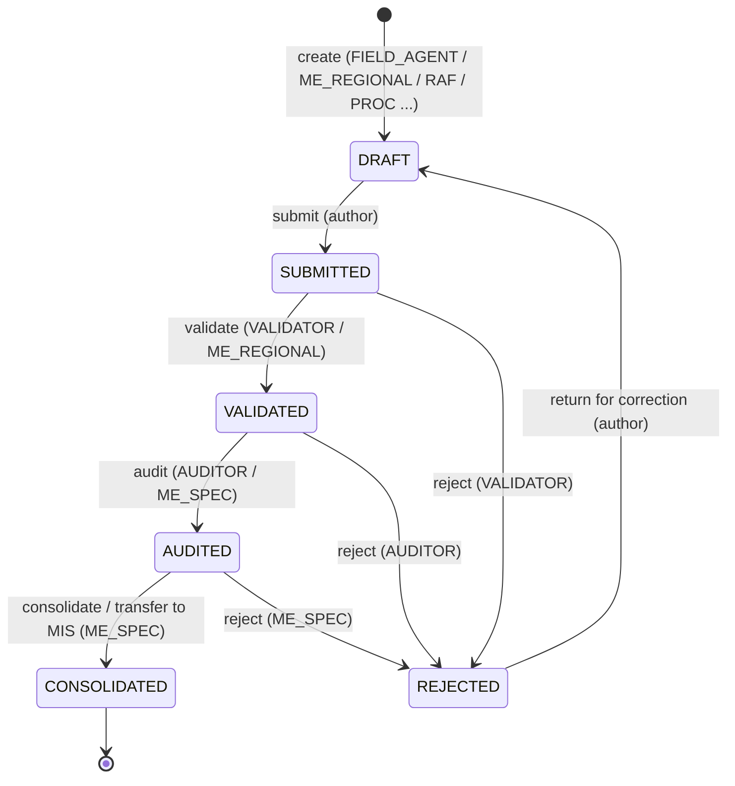

# 03 — RBAC & data lifecycle workflow

This implements two things the manual insists on:

1. **The circuit d’information** — data is *collected* at the base, *consolidated* upward, and
   *restituted* — with **separation of “Saisie” (entry) from “Consultation”**, password‑gated entry,
   and a public read path that cannot modify anything (§2.3.4 of the manual).
2. **The roles annex** — for every indicator there are distinct responsibilities:
   *collecte → validation → audit/contrôle → transfert vers le MIS → agrégation → analyse*.

We model this as **role‑based access control with geographic/programme scoping** plus a **record
state machine** that mirrors those six responsibilities.

## 3.1 Seeded roles

`Role.is_system = true` for all of these (cannot be deleted; can be assigned). Codes are stable.

| code | Label (fr) | Maps to manual position | Typical scope |
|---|---|---|---|
| `ADMIN` | Administrateur système | IT / informaticien UGP | Whole project (or all projects) |
| `COORDINATOR` | Coordonnateur | Coordonnateur du PRDC‑VFS | Whole project, read + approve |
| `ME_SPECIALIST` | Spécialiste / Expert S&E | RSE / Expert Suivi‑Évaluation (UGP) | Whole project |
| `ME_REGIONAL` | S&E régional / Chef d’antenne | Assistant S&E / Chef d’antenne | One Wilaya (geo scope) |
| `FIELD_AGENT` | Agent de terrain | Agent terrain / ONG locale / point focal communal | One/few communes (geo scope) |
| `VALIDATOR` | Superviseur / Validateur | Superviseur, M&E régional (validation) | One Wilaya |
| `AUDITOR` | Auditeur / Contrôle qualité | Responsable audit & contrôle | Whole project / region |
| `RAF` | Responsable Administratif & Financier | RAF | Whole project (finance) |
| `PROCUREMENT_OFFICER` | Responsable passation (APM) | APM / spécialiste passation | Whole project (procurement) |
| `GENDER_OFFICER` | Responsable Genre | Responsable Genre | Whole project (gender indicators) |
| `INFRA_ENGINEER` | Ingénieur infrastructure | Ingénieur infra régional/central | Region or whole project |
| `GRIEVANCE_OFFICER` | Responsable MGP | Responsable MGP | Whole project (grievances) |
| `LOCAL_DEV_OFFICER` | Responsable développement local | Responsable développement local | Whole project |
| `COMPONENT_MANAGER` | Responsable de composante | Responsables de composantes | One ProgramNode (program scope) |
| `EXTERNAL_CONSULTANT` | Consultant externe | Consultants/bureaux d’études | Limited, often a single study |
| `VALIDATION_COMMITTEE` | Comité de validation | Comité technique régional / CRC | Project (approve studies) |
| `VIEWER` | Lecteur (consultation) | Public/COPIL/MASA read access | Read‑only |

A user can hold **several roles**, each with its own scope, via `RoleAssignment`. Example: a person
is `ME_REGIONAL` scoped to *Brakna* and also `VALIDATOR` scoped to *Brakna*.

## 3.2 Capabilities (what roles can do)

Capabilities are grouped by **domain area** (indicators/measurements, activities, finance,
procurement, grievances, reporting, configuration) and by **action** (view, create/edit‑draft,
submit, validate, audit, consolidate, manage‑config).

Permission check = **role grants the capability** **AND** the record is **in the user’s scope**
(geo and/or program). Scope is hierarchical: a geo scope on *Brakna* covers Brakna and all its
descendant moughataas/communes/villages; no scope = whole project.

### Capability matrix (✓ = allowed)

| Capability ↓ / Role → | ADMIN | COORD | ME_SPEC | ME_REG | FIELD | VALID | AUDIT | RAF | PROC | GRIEV | COMP_MGR | VIEWER |
|---|:--:|:--:|:--:|:--:|:--:|:--:|:--:|:--:|:--:|:--:|:--:|:--:|
| View (in scope) | ✓ | ✓ | ✓ | ✓ | ✓ | ✓ | ✓ | ✓ | ✓ | ✓ | ✓ | ✓ |
| Create/edit **draft** measurement & activity | ✓ |  | ✓ | ✓ | ✓ |  |  |  |  |  | ✓ |  |
| **Submit** measurement & activity | ✓ |  | ✓ | ✓ | ✓ |  |  |  |  |  | ✓ |  |
| **Validate** | ✓ |  | ✓ | ✓ |  | ✓ |  |  |  |  |  |  |
| **Audit** | ✓ |  | ✓ |  |  |  | ✓ |  |  |  |  |  |
| **Consolidate** (publish to MIS) | ✓ |  | ✓ |  |  |  |  |  |  |  |  |  |
| Create/edit draft **financial** tx | ✓ |  |  |  |  |  |  | ✓ |  |  |  |  |
| Validate/consolidate financial | ✓ | ✓ | ✓ |  |  |  |  | ✓ |  |  |  |  |
| Create/edit **procurement** | ✓ |  |  |  |  |  |  |  | ✓ |  |  |  |
| Validate/consolidate procurement | ✓ | ✓ |  |  |  |  |  | ✓ | ✓ |  |  |  |
| Register/manage **grievances** | ✓ |  |  | ✓ | ✓ |  |  |  |  | ✓ |  |  |
| Resolve grievances | ✓ |  |  |  |  |  |  |  |  | ✓ |  |  |
| Generate **reports** | ✓ | ✓ | ✓ |  |  |  |  | ✓ |  |  |  |  |
| Manage **configuration** (geo, program, indicators, categories, methods, milestones) | ✓ |  | ✓* |  |  |  |  |  |  |  |  |  |
| Manage **users & roles** | ✓ |  |  |  |  |  |  |  |  |  |  |  |

`ME_SPEC` config rights (`✓*`) cover indicators, targets, dimensions, activities config — but **not**
user/role management (ADMIN only). `GENDER_OFFICER`, `INFRA_ENGINEER`, `LOCAL_DEV_OFFICER`,
`EXTERNAL_CONSULTANT`, `VALIDATION_COMMITTEE` behave like specialised validators/viewers for their
indicators — grant them View everywhere and Validate on the indicators where the roles annex names
them (enforced via `IndicatorResponsibility`; see §3.5).

> Implement capabilities as a fixed list of permission codes (e.g. `measurement.validate`) and a
> static `ROLE_CAPABILITIES: dict[role_code, set[capability_code]]` map in `accounts`. Don’t scatter
> role checks across the codebase; centralise in one `has_capability(user, capability, obj=None)`
> helper that also runs the scope check.

## 3.3 The record state machine

Applies to `Measurement`, `Activity`, `FinancialTransaction`, `ProcurementProcess`, `Grievance`
(its data‑quality `status`, separate from the grievance’s own resolution `state`).

Semantics mapped to the roles annex:

| State | Meaning | Set by (responsibility) |
|---|---|---|
| `DRAFT` | Being captured; editable; can be hard‑deleted | **Collecte** (field agent) |
| `SUBMITTED` | Sent up for validation; read‑only to author | author submits |
| `VALIDATED` | Checked for completeness/plausibility | **Validation** (superviseur / M&E régional) |
| `AUDITED` | Quality‑controlled | **Audit/contrôle** (auditeur) |
| `CONSOLIDATED` | In the MIS / official; feeds dashboards & aggregation | **Transfert vers le MIS** (Spécialiste S&E / IT) |
| `REJECTED` | Sent back with a comment | any reviewer at their step |

**Aggregation** and **analyse** are not record states — they happen automatically on
`CONSOLIDATED` data (the reporting views aggregate; Metabase analyses). This matches the manual:
once data is consolidated/transferred to the MIS, the Spécialiste S&E aggregates and the Expert S&E
analyses.

### Rules

- Only `CONSOLIDATED` records count in **official** dashboards/exports. Provide a toggle in Metabase
  filters (`status` parameter) so M&E staff can also see in‑pipeline data, but the default report
  view is consolidated‑only.
- Edits to a `CONSOLIDATED` record require an explicit **re‑open** by `ME_SPECIALIST`/`ADMIN`, which
  sends it back to `DRAFT` and is logged. (No silent edits to official data.)
- Every transition writes a `StateEvent` (actor, from, to, action, timestamp, comment). The UI shows
  this as a timeline on the record.
- `django-simple-history` records field‑level diffs on `Measurement`, `FinancialTransaction`,
  `ProcurementProcess`, `Grievance`, and the configuration models.

### Backend implementation

- A `WorkflowMixin` (in `core`) adds `status`, the `transition(user, action, comment="")` method,
  and validates the transition against an `ALLOWED_TRANSITIONS` map + `has_capability`.
- Transitions are exposed as **DRF actions**, not generic PATCH of `status`:
  `POST /api/v1/<resource>/<id>/submit/`, `/validate/`, `/audit/`, `/consolidate/`, `/reject/`,
  `/reopen/`. Each returns the updated record + the new `StateEvent`.

## 3.4 Scoping enforcement

- `RoleAssignment.scope_geo` / `scope_program` restrict what a user sees and touches.
- List querysets are filtered: `accessible_geo_units(user, project)` returns the set of geo units in
  any of the user’s geo scopes (closure of descendants); records with a `geo_unit` outside that set
  are excluded. No geo scope on a role ⇒ whole project.
- Object‑level checks in `has_capability(user, cap, obj)` re‑verify scope before any write/transition.
- `VIEWER` and public consultation never get write capabilities regardless of scope.

## 3.5 Indicator‑level responsibility (the annex columns)

`IndicatorResponsibility` records, per indicator, who is responsible for COLLECTION / VALIDATION /
AUDIT / TRANSFER_MIS / AGGREGATION / ANALYSIS (by Role and/or named User). This is used to:

- **Pre‑fill** the reviewer suggestions in the workflow UI (“validation due by: Chef d’antenne”).
- **Authorise** specialised reviewers: e.g. for a gender indicator the annex names *Responsable
  Genre* as validator → a `GENDER_OFFICER` may validate that indicator’s measurements even though the
  generic matrix wouldn’t grant it. The check is: `has_capability(...)` **OR** the user’s role/identity
  matches an `IndicatorResponsibility` for that indicator and step.
- Render the **“Plan détaillé des rôles et responsabilités”** table (a read‑only screen + an export),
  reproducing the manual’s annex from live data.

## 3.6 Public / consultation access

- A `VIEWER` account (or an unauthenticated public mode, configurable per project via
  `Project.public_dashboards_enabled`) can see **consolidated** dashboards and summary tables only.
- Public mode, if enabled, serves a **separate set of Metabase signed embeds** with `status` locked
  to `CONSOLIDATED` and no data‑entry routes in the SPA. This realises the manual’s “consultation by a
  wider public without the ability to modify anything”.
